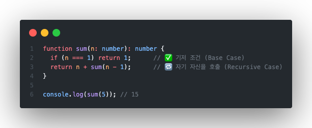

# 🌀 재귀함수(Recursion) 이해하기

재귀함수는 **자기 자신을 호출하는 함수**입니다.  
복잡한 반복문 대신 **문제를 더 작은 단위로 쪼개서 해결**할 수 있게 도와주는 핵심 개념입니다.

---

## 1️⃣ 재귀함수의 핵심 개념

재귀(recursion)는 어떤 문제를  

> "같은 구조의 더 작은 문제로 나누어 푸는 방식"  
> 으로 접근합니다.

- 문제를 나누고 (Divide)
- 더 이상 나눌 수 없는 **기저 조건(Base Case)** 에서 멈추며
- 나눈 결과를 조합(Combine)합니다.

---