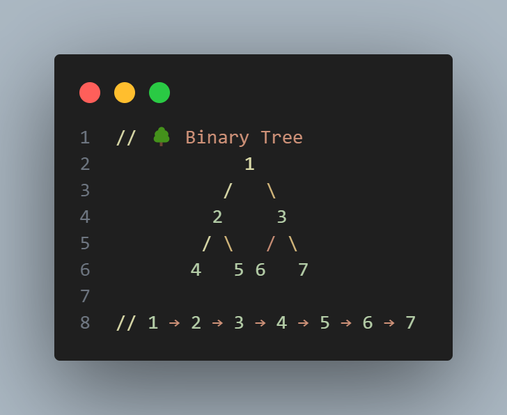

# 🌳 이진트리 넓이 우선 탐색 (BFS: Breadth-First Search)



**넓이 우선 탐색(BFS, Breadth-First Search)** 은  
트리나 그래프를 탐색할 때 **같은 레벨(층)** 에 있는 노드를 먼저 방문하는 알고리즘입니다.

---

## 1️⃣ BFS의 핵심 개념

> **"가까운 노드부터 탐색한다"**

즉, 루트에서 시작해서  
1층 → 2층 → 3층 순으로 **넓게 퍼져 나가며** 탐색하는 방식입니다.

이를 위해 **큐(Queue)** 자료구조를 활용합니다.

- **FIFO (First In, First Out)** 먼저 들어온 노드부터 처리

---

## 2️⃣ BFS 기본 구조

BFS 알고리즘의 일반적인 흐름은 다음과 같습니다 👇

|단계|설명|
|:---|:---|
|① 시작 노드를 큐에 넣음|탐색의 시작점|
|② 큐에서 노드를 꺼내 처리|현재 노드 방문|
|③ 인접한 노드를 모두 큐에 추가|다음 단계 탐색 준비|
|④ 큐가 빌 때까지 ②~③을 반복|모든 노드 탐색 완료|

---

## 3️⃣ 예시 코드: 이진 트리 BFS 탐색

```ts
function solution() {
  let answer = "";
  let queue = [];
  queue.push(1); // 루트 노드 (시작점)

  while (queue.length) {
    let v = queue.shift();   // 큐의 맨 앞 노드를 꺼냄
    answer += v + " ";       // 방문 순서 기록

    // 현재 노드의 자식 노드 (왼쪽, 오른쪽)
    for (let nv of [v * 2, v * 2 + 1]) {
      if (nv > 7) continue;  // 트리의 최대 노드는 7
      queue.push(nv);        // 다음 레벨의 노드 추가
    }
  }

  return answer;
}

console.log(solution()); // ✅ 출력: 1 2 3 4 5 6 7
```

### 🚀 탐색 순서 (Queue 흐름)

```bash
queue: [1]
→ 방문: 1  → 자식 [2,3] 추가

queue: [2,3]
→ 방문: 2  → 자식 [4,5] 추가

queue: [3,4,5]
→ 방문: 3  → 자식 [6,7] 추가

queue: [4,5,6,7]
→ 방문: 4, 5, 6, 7 → 종료

✅ 방문 순서: 1 → 2 → 3 → 4 → 5 → 6 → 7
```

---