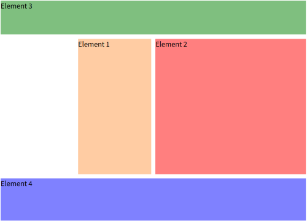

# Grid 핵심 속성 정리
**CSS Grid Layout**은 2차원 레이아웃 시스템으로, **행(Row)**과 **열(Column)**을 기반으로 정밀하고 유연한 배치를 할 수 있게 해줍니다.

---
<br>

## 1️⃣ `dispaly: grid` - 그리드 컨테이너
그리드 레이아웃을 시작하려면 부모 요소에 `display: grid`를 지정합니다.
자식 요소들은 자동으로 grid item이 됩니다.
```css
.container {
	display: grid;
}
```
📌 `inline-grid` 사용 시 인라인 요소로 유지하면서 그리드 적용 가능

---
<br>

## 2️⃣ `grid-template-columns` & `grid-template-rows` – 열과 행 정의하기
**그리드의 열/행 개수**와 **크기**를 설정합니다.

```css
.container {
  grid-template-columns: repeat(4, 1fr); 
  grid-template-rows: 100px auto;
}
```
📌 **주요 단위**
- `fr`: 남은 공간의 비율
- `auto`: 콘텐츠 크기
- `px`, `%`, `min-content`, `max-content` 등 사용 가능

### 🧐 실전 예시
```css
.container {
  grid-template-columns: [hd-start] repeat(4, [col-start] 20% [col-end]) [hd-end]
}
```
✔️ 각 열에 라벨 지정 가능 (`[col-start]`, `[col-end]`) → **가독성 향상**

---
<br>

## 3️⃣ `grid-template-areas` – 시각적 영역 배치
그리디 셀에 이름을 붙여서 시각적으로 영역을 나눕니다.
<br>


```css
.container {
  grid-template-areas: "header header header header"
                       ". side main main"
                       "footer footer footer footer";
}
```

자식 요소에 `grid-area` 지정
```css
.el1 { grid-area: side; }
.el2 { grid-area: main; }
.el3 { grid-area: header; }
.el4 { grid-area: footer; }
```
---
<br>

## 4️⃣ `grid-column`, `grid-row` - 위치와 병합 지정
아이템이 차지할 **위치**나 **범위(병합)**를 설정합니다.

```css
.quote:nth-of-type(2) {
  grid-column: span 2; /* 열 2칸 병합 */
}
```
```css
.el2 {
  grid-row: row-2-start / span 1;
}
```
✔️ `span` 키워드  → 병합할 칸 수 명시
✔️ 라인 이름 활용 가능 (예: `row-2-start / row-2-end`)

- `span` 키워드를 활용해 **셀 병합**가능
- 숫자 값은 **그리드 라인 번호** 기준

---
<br>

## 5️⃣ `repeat()` – 패턴 반복
같은 크기의 열/행이 반복될 경우 간단히 표현합니다.

```css
.container {
  grid-template-columns: repeat(3, 10rem);
}
```
또는 자동 채움/맞춤도 가능
```css
grid-template-columns: repeat(auto-fill, 10rem);
```
📌 **auto-fill vs auto-fit 차이**
- `auto-fill`: 빈칸도 유지
- `auto-fit`: 가능한 한 줄임

---
<br>

## 6️⃣ `minmax()` – 유동 크기 제한
**최소값~최대값** 범위 내에서 자동 크기 조절
```css
.container {
  grid-template-rows: minmax(10px, 20rem);
}
```
📌 반응형 디자인에서 자주 사용됨

---
<br>

## 7️⃣ `grid-auto-flow`, `grid-auto-rows`, `grid-auto-columns` – 자동 배치 제어
- `grid-auto-flow`: 자동 배치 방향 (`row`, `column`, `dense`);
- `grid-auto-rows`: 자동 생성되는 행의 기본 높이
- `grid-auto-columns`: 자동 생성되는 열의 기본 너비

```css
.container {
  grid-auto-flow: row dense;  /* 밀집하게 배치 (주의 필요) */
  grid-auto-rows: minmax(8rem, auto);
}
```

---
<br>

## 8️⃣ justify-items, align-items – 개별 셀 내부 정렬
아이템 자체의 정렬을 설정합니다.
```css
.container {
  justify-items: stretch;
  align-items: stretch;
}
```
✔️ 값: `start`, `center`, `end`, `stretch`


---
<br>

## 9️⃣ 반응형 레이아웃 – 미디어 쿼리와 함께
그리드 구조를 뷰포트 크기에 따라 변경합니다.
```css
@media (max-width: 40rem) {
  .container {
    grid-template-areas:
      "header header header header"
      "main main main main"
      "side side side side"
      "footer footer footer footer";
  }
}
```
✔️ 모바일에서는 **열을 줄이고 순서를 재배치**

