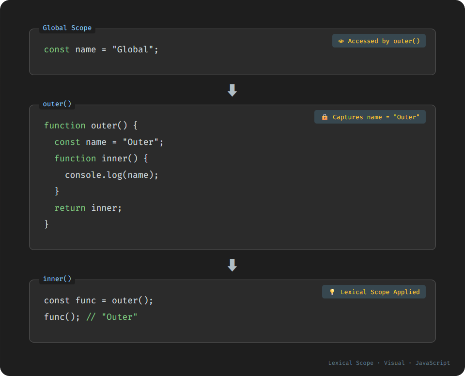

# 렉시컬 스코프 (Lexical Scope)

## 1️⃣ 핵심 개념: 렉시컬 스코프란?
> **렉시컬 스코프**는 "코드가 작성된 위치"를 기준으로 변수의 유효 범위를 결정하는 스코프 규칙입니다.

자바스크립트는 **렉시컬 스코프를 따르는 정적 스코프 언어**입니다.  
즉, 변수 참조는 함수가 **어디서 호출되었는지**가 아니라, **어디에서 정의되었는지**로 결정됩니다.

### 🧐 간단한 예시
```js
let message = "global";

function outer() {
  let message = "outer";

  function inner() {
    console.log(message);
  }

  return inner;
}

const fn = outer();
fn(); // "outer"
```
- `inner()`는 `outer()` 내부에서 정의되었기 때문에, 외부 변수 `message = "outer"`를 참조
- 호출 위치가 아니라 **정의 위치**가 기준

---

## 2️⃣ 렉시컬 스코프의 구조
### 🔹 렉시컬 환경 (Lexical Environment)
함수가 실행될 때 자바스크립트는 내부적으로 **렉시컬 환경 객체**를 생성합니다. 이 객체는 다음으로 구성됩니다.
1. **환경 레코드(Environment Record)**: 현재 스코프에서 선언된 변수, 상수, 함수 등을 저장
2. **외부 렉시컬 환경 참조(Outer Lexical Environment Reference)**: 상위 스코프의 렉시컬 환경을 참조

이 구조는 **스코프 체인(Scope Chain)** 을 형성하며, 변수 탐색 시 바깥으로 계속 따라 올라가면 찾습니다.

---

## 3️⃣ 선언 위치 vs 호출 위치
```js
let x = 1;

function logX() {
  console.log(x);
}

function wrapper() {
  let x = 100;
  logX(); // 1
}

wrapper();
```
- `logX()`는 전역에서 정의됨 → 전역의 `x`를 참조
- `wrapper()`안에서 호출되었어도 영향 없음
---

## 4️⃣ 렉시컬 스코프 + 클로저
```js
function makeCounter() {
  let count = 0;

  return function() {
    count++;
    return count;
  };
}

const counter = makeCounter();
console.log(counter());
console.log(counter());
```
- 내부 함수가 외부 변수 `count`를 참조
- 렉시컬 스코프 덕분에 외부 변수가 계속 살아 있음 → **클로저**