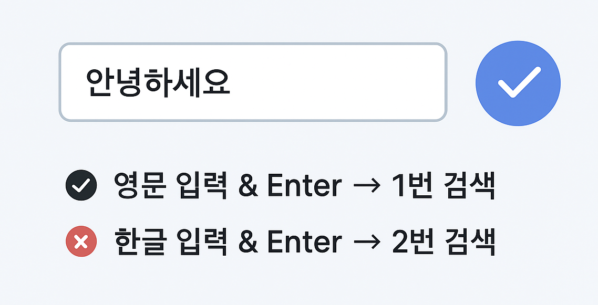

# 한글 입력 시 Enter 중복 검색 문제 해결


## 1️⃣ 문제 상황
검색 input에서 **한글 입력 후 Enter**를 누르면
검색 함수가 **두 번 실행**되는 문제가 발생합니다.

- 영문 입력 + Enter → 1번 실행 ✅
- 한글 입력 + Enter → 2번 실행 ❌

---

## 2️⃣ 왜 그럴까? (composition 이벤트)
한글은 **조합형 입력**이라 키 하나가 곧바로 글자가 아닙니다.  
→ 조합 과정에서 브라우저가 `compositionend`(조합 끝) + `Enter` 이벤트를 연속으로 발생시켜요.

그래서 `Enter` 이벤트만 보고 검색을 실행하면,  
**"조합 끝"** + **"Enter"** 두 번이 호출됩니다.

---

## 3️⃣ 잘못된 예시 코드 (중복 발생)
```js
// (문제 예시) 한글 입력 시 두 번 실행됨
$("input").on("compositionend", function() {
  search();   // 조합 끝났다고 바로 검색 ❌
});
$("input").on("keyup", function(e) {
  if (e.keyCode === 13) search(); // Enter에서 또 검색 ❌
});
```

---

## 4️⃣ 올바른 해결 방법
**조합 중인지 여부(flag)**를 체크해서
조합이 끝나고 나서 Enter 입력이 들어왔을 때만 검색 실행합니다.

```js
let isComposing = false;

$("input")
  .on("compositionstart", () => { isComposing = true; })
  .on("compositionend", () => { isComposing = false; })
  .on("keydown", function(e) {
    if (e.keyCode === 13 && !isComposing) {
      e.preventDefault();
      search(); // 한 번만 실행 ✅
    }
  });
```

 ✅ 이렇게 하면
- 영문 + Enter → 1번 실행
- 한글 + Enter → 1번 실행
---

### 👉 정리
문제는 **“한글 조합 종료 + Enter 이벤트가 둘 다 실행돼서 중복”** 이고,
해결은 “조합 중인지 체크 후 Enter만 처리”입니다.