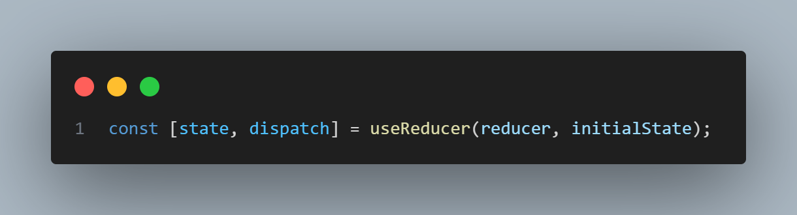

# useReducer 구조와 동작 원리
`useReducer`는 React의 상태 관리 훅 중 하나로,  
**상태(state) 와 상태 변경 로직(reducer)을 명확히 분리**할 수 있습니다.



---

## 1️⃣ 구조

```tsx
const [state, dispatch] = useReducer(reducer, initialState);
```

### 🔹 반환값 구조

|이름|타입|설명|
|:---|:---|:---|
|`state`|any|현재 상태 값|
|`dispatch`|function|상태 변경을 요청하는 함수 (액션 전달)|

### 🔹 매개변수 구조


|이름|타입|
|:---|:---|
|`reducer(state, action)`|상태 변경 로직을 담은 함수|
|`initialState`|초기 상태 값|

---

## 2️⃣ reducer의 역할

`useReducer`에서 가장 핵심은 `reducer` **함수**입니다.  
이 함수는 현재 상태(`state`)와 전달 받은 액션(`action`)을 기반으로 **새로운 상태를 반환하는 순수 함수(pure function)** 입니다.

```tsx
function reducer(state, action) {
  switch (action.type) {
    case "increment":
      return { count: state.count + 1 };
    case "decrement":
      return { count: state.count - 1 };
    default:
      return state;
  }
}
```

- `reducer`는 **이전 상태를 직접 변경하지 않고, 새로운 객체를 반환**해야 합니다.
- 상태 변경의 모든 로직으 이 함수 안에 정의되므로, 컴포넌트에서는 단순히 `dispatch({ type: "increment" })` 같은 **액션을 전달**하기만 하면 됩니다.

> 💡 즉, `useReducer`는 `state`를 직접 다루지 않고  
`reducer`를 통해 "상태 변경 규칙"을 외부로 분리하는 방식입니다.

---

## 3️⃣ useReducer의 실행 과정

1. 컴포넌트가 처음 렌더링 되면 `useReducer`가 `initialState`를 기준으로 `state`를 생성
2. `dispatch(action)`이 호출되면 React가 내부적으로 `reducer(state, action)` 실행
3. 새로운 `state`가 반환되면, React는 리렌더링을 트리거

> 💡 즉, `dispatch`는 단순히 "액션을 reducer로 전달하는 트리거"일 뿐,  
상태 변경 자체는 **reducer 함수**가 담당합니다.

---

## ✍️ 요약

- `useReducer`는 상태와 상태 변경 로직을 분리하는 훅  
- `reducer(state, action)`은 순수 함수로 새로운 상태를 반환  
- `dispatch(action)`은 상태 변경을 트리거하는 역할  