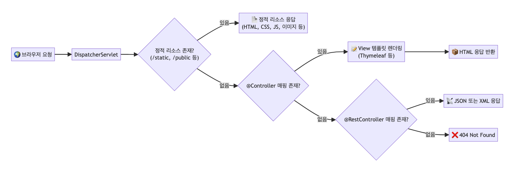

# Spring Boot 웹 요청 처리 흐름 정리(Staic, Template, API)


Spring Boot 애플리케이션에서 웹 브라우저의 요청이 들어왔을 때,  
**정적 컨텐츠**, **동적 템플릿**, **API** 응답 중 어떤 방식으로 처리되는지에 대해 정리합니다.

<br>

## 1️⃣ 전체 흐름 개요
Spring Boot는 클라이언트의 HTTP 요청이 들어오면 아래 순서대로 응답을 결정합니다.
```css
[웹 브라우저 요청] 
		↓
[스프링 내부 DispatcherServlet]
		↓
[static 디렉토리 확인]
		↓
[Controller 핸들러 매핑 확인]
		↓
[404 에러 또는 예외 처리]
```

### 🔹 처리 우선순위
1. 정적 리소스 (resources/static, public, etc)
2. @Controller (템플릿 뷰 렌더링)
3. @RestController (API 응답)

---
<br>


## 2️⃣ 정적 컨텐츠 (Static)
- 위치: `resources/static/` (또는 `/public`, `/resources`)
- 특징: **서버에서 가공없이 그대로 반환**
- 예시 파일: `hello.html`, `style.css`, `logo.png`
- 사용 상황: 고정된 리소스 제공 (정적 사이트, JS, 이미지 등)

### 🧐 예시
```html
<!-- static/hello.html -->
<h1>Hello Static</h1>
```
✔️ 요청: `GET /hello.html` → 해당 HTML 문서 그대로 브라우저로 전달

---
<br>

## 3️⃣ 동적 컨텐츠 (Template + Controller)
- 위치: `resources/templates/`
- 렌더링 엔진: Thymeleaf, Mustache 등
- 컨트롤러에서 **Model 데이터를 담아** 템플릿과 함께 렌더링

### 🧐 예시
```java
@Controller
public class HelloController {
	@GetMapping("/hello")
	public String hello(Model model) {
		model.addAttribute("name", "Spring Boot");
		return "hello";
	}
}
```
```html
<!-- templates/hello.html -->
<p>Hello, [[${name}]]!</p>
```
✔️ 요청: `GET /hello` → 템플릿 엔진이 서버에서 HTML을 생성해 응답

---
<br>

## 4️⃣ API 응답 (@RestController)
- 주 목적: **데이터만 전달**
- 변환 형식: JSON, XML 등 (보통 JSON)
- 프론트엔드(SPA)나 모바일 앱과의 통신용

### 🧐 예시
```java
@RestController
public class HelloApi {
  @GetMapping("/api/hello")
  public Map<String, String> hello() {
    return Map.of("message", "Hello, API");
  }
}
```
✔️ 요청: `GET /api/hello` → `{ "message": "Hello, API" }` 형태(JSON)로 응답

---
<br>

