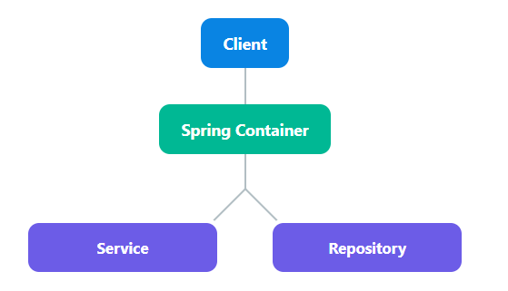

# 의존성 주입(Dependency Injection, DI) 정리


Spring Framework의 핵심 기능 중 하나인 **의존성 주입(DI)** 은 객체 간의 **의존 관계를 스프링 컨테이너가 자동으로 연결해 주는 개념**입니다.  
DI를 통해 객체 간 결합도를 낮추고, 테스트가 용이하며, 변경에 유연한 설계를 가능하게 합니다.

---

## 1️⃣ 의존성 주입(DI)이란?
> 객체가 의존하는 다른 객체를 **직접 생성하지 않고,** 외주에서 주입(Injection)받는 방식.

### 💡 왜 사용하는가?
- 객체 간 **강한 결합도를 낮추기 위해**
- 코드의 **재사용성, 테스트 용이성, 유지보수성** 증가
- 객체 생성 및 관계 설정을 **스프링 컨테이너가 책임**지게 하여, 개발자는 로직에 집중 가능

---

## 2️⃣ DI 사용 방법
Spring에서는 주로 다음 3가지 방식으로 의존성을 주입합니다.

### ① 생성자 주입 (⭐추천)
- **불변성과 테스트 용이성** 확보 가능
- 스프링 공식 문서 및 대부분의 실무 프로젝트에서 **기본 방식**으로 권장

```java
@Component
public class OrderService {
    private final MemberRepository memberRepository;

    @Autowired  // 생략 가능 (생성자가 1개면)
    public OrderService(MemberRepository memberRepository) {
        this.memberRepository = memberRepository;
    }
}
```

> 📌 **장점**  
✅ `final` 키워드 사용 가능 → 불변 보장  
✅ 필수 의존성 보장 (컴파일 시정에 체크)  
✅ 테스트 시 Mock 주입이 쉬움

---

### ② 필드 주입 (❌권장하지 않음)
코드가 짧고 간단하지만, **테스트 어려움** + **순환 참조 위험**
```java
@Component
public class OrderService {
    @Autowired
    private MemberRepository memberRepository;
}
```
> 📌 **단점**  
❌ `final` 사용 불가  
❌ DI가 프레임워크에 종속됨 (테스트 시 DI 불가)  
❌ 의존성 주입이 외부에서 불가능해짐 → 테스트 유연성 떨어짐

---

### ③ 수정자(Setter) 주입
- 선택적 의존성 주입에 적합
- **필수는 생성자, 선택은 Setter** 방식으로 혼용 가능
```java
@Component
public class OrderService {
    private MemberRepository memberRepository;

    @Autowired
    public void setMemberRepository(MemberRepository memberRepository) {
        this.memberRepository = memberRepository;
    }
}
```
> 🧐 **사용 예**: `@ConfigurationProperties`, 외부 설정을 받아야 하는 객체 등

---

## 3️⃣ DI 대상 관리: 스프링 빈
스프링 컨테이너가 관리하는 객체를 **스프링 빈**이라고 하며, DI를 통해 빈들 간의 의존성을 연결합니다.
```java
@Service
public class MemberService { ... }

@Repository
public class MemberRepository { ... }
```
✔️ 컴포넌트 스캔을 통해 등록된 클래스들은 자동으로 스프링 빈이 되고, 의존성 주입 대상이 됨

---

## 4️⃣ 실전 예시
### 📦 구성
- `MemberService` → `MemberRepository` 에 의존
```java
@Service
public class MemberService {
    private final MemberRepository memberRepository;

    public MemberService(MemberRepository memberRepository) {
        this.memberRepository = memberRepository;
    }

    public String getMember(Long id) {
        return memberRepository.findNameById(id);
    }
}

@Repository
public class MemberRepository {
    public String findNameById(Long id) {
        return "User" + id;
    }
}
```
✔️ MemberService는 `MemberRepository` 가 필요하지만 직접 생성하지 않음  
✔️ 스프링이 자동으로 생성 후, 주입
