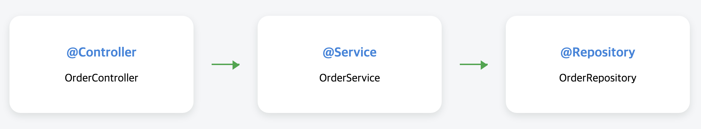

# 스프링 빈(Spring Bean)


## 1️⃣ 스프링 빈이란?
> **스프링 빈(Spring Bean)** 은 **스프링 컨테이너**가 생성하고 관리하는 객체를 말합니다.

보통 우리가 자바에서 객체를 사용할 땐 `new` 키워드로 직겁 생성합니다. 하지만 스프링에서는 **객체 생성부터 의존성 주입까지** 스프링이 대신 해주는 구조를 사용합니다.  
이때 **스프링이 관리하는 객체**를 **빈(Bean)** 이라고 부릅니다.

예를 들어
```java
public class HelloService {
	public String sayHello() {
		return "Hello, Spring!";
	}
}
```
이 클래스를 직접 사용하는 대신, 스프링에 등록하면 다음처럼 사용 가능
```java
@Service
public class HelloService {
    public String sayHello() {
        return "Hello, Spring!";
    }
}

@RestController
public class HelloController {
    private final HelloService helloService;

    // 의존성 주입 (DI)
    public HelloController(HelloService helloService) {
        this.helloService = helloService;
    }

    @GetMapping("/hello")
    public String hello() {
        return helloService.sayHello();
    }
}
```
✔️ 스프링은 `HelloService`를 빈으로 등록하고, `HelloController`에 자동을 주입해줍니다.

---

## 2️⃣ 빈은 어떻게 등록할까?
스프링에서 빈을 등록하는 방법은 크게 2가지가 있습니다.

### ① 자동 등록 (컴포넌트 스캔 기반)
클래스에 어노테이션을 붙이면 스프링이 자동으로 빈으로 등록해줍니다.

|어노테이션|의미|
|:---|:---|
|`@Component`|기본 컴포넌트|
|`@Controller`|웹 요청 처리용|
|`@Service`|비즈니스 로직용|
|`@Repository`|DAO/DB 접근용|

```java
@Component
public class MyComponent {}

@Service
public class MyService {}

@Repository
public class MyRepository {}

@Controller
public class MyController {}
```
✔️ 이 방식은 `@ComponentScan`이 설정된 위치 이하의 클래스들만 스캔됩니다.

### ② 수동 등록 (Java Config 방식)
Java 설정 파일에서 직접 빈을 등록할 수 있습니다.

```java
@Configuration
public class AppConfig {

    @Bean
    public MyService myService() {
        return new MyService();
    }
}
```
✔️ 주로 외부 라이브러리처럼 내가 직접 어노테이션을 못 붙이는 클래스에 사용합니다.

---

## 3️⃣ 스프링 빈을 왜 쓰는가?
### 🔹 객체 관리 책임 분리 - 내가 `new` 하지 않아도 됨
#### 💬 문제 상황
```java
public class UserController {
    private UserService userService = new UserService(); // 직접 생성
}
```
⚠️ 클래스 내부에서 직접 객체를 만들면, 책임이 이곳저곳에 흩어 집니다.  
⚠️ 누가 만들고 누가 관리하는지 파악하기 어렵습니다.

#### ✅ 스프링 방식
```java
@RestController
public class UserController {
    private final UserService userService;

    // 스프링이 UserService를 자동으로 주입!
    public UserController(UserService userService) {
        this.userService = userService;
    }
}
```
- **개발자는 객체 생성에 신경 안 써도 되게끔** 스프링이 알아서 생성해서 넣어줍니다.

---

### 🔹 의존성 주입 (DI) – 바꿔 끼우기 쉬운 구조
#### 💬 문제 상황
```java
public class PayService {
    private final KakaoPay kakaoPay = new KakaoPay(); // 고정됨
}
```
⚠️ `TossPay`로 바꾸려면 `PayService` 코드를 수정해야 합니다.

#### ✅ 스프링 방식
```java
public interface Payment {
    void pay();
}

@Component
public class KakaoPay implements Payment {
    public void pay() { System.out.println("카카오 결제"); }
}

@Component
public class TossPay implements Payment {
    public void pay() { System.out.println("토스 결제"); }
}

@Service
public class PayService {
    private final Payment payment;

    public PayService(Payment payment) {
        this.payment = payment;
    }
}
```
- 원하는 구현체만 바꾸면 끝(`@Primary`, `@Qualifier`로 선택 가능)
- 테스트용 Mock 객체도 쉽게 주입 가능

##### 🧐 @Primary, @Qualifier 예시
```java
// @Primary 예시
@Component
@Primary
public class KakaoPay implements Payment {
    public void pay() { System.out.println("카카오 결제"); }
}
// PayService에서 기본적으로 KakaoPay가 주입
```
```java
// @Qualifier 예시
@Service
public class PayService {
    private final Payment payment;

    public PayService(@Qualifier("tossPay") Payment payment) {
        this.payment = payment;
    }
}
```


---

### 🔹 싱글톤 관리 - 객체 하나로 다 같이 씀
#### 💬 문제 상황
```java
OrderService order1 = new OrderService();
OrderService order2 = new OrderService();

System.out.println(order1 == order2); // false
```
⚠️ 직접 생성하면 매번 새 객체 → 상태 불일치, 메모리 낭비 위험.

#### ✅ 스프링 방식
```java
@Component
public class OrderService {
    // 내부 로직
}
```
```java
@Autowired
OrderService order1;

@Autowired
OrderService order2;

System.out.println(order1 == order2); // true
```
- 스프링이 **싱글톤으로 객체를 한 번만 만들고 재사용**함 → 메모리 절약 + 상태 공유 가능

