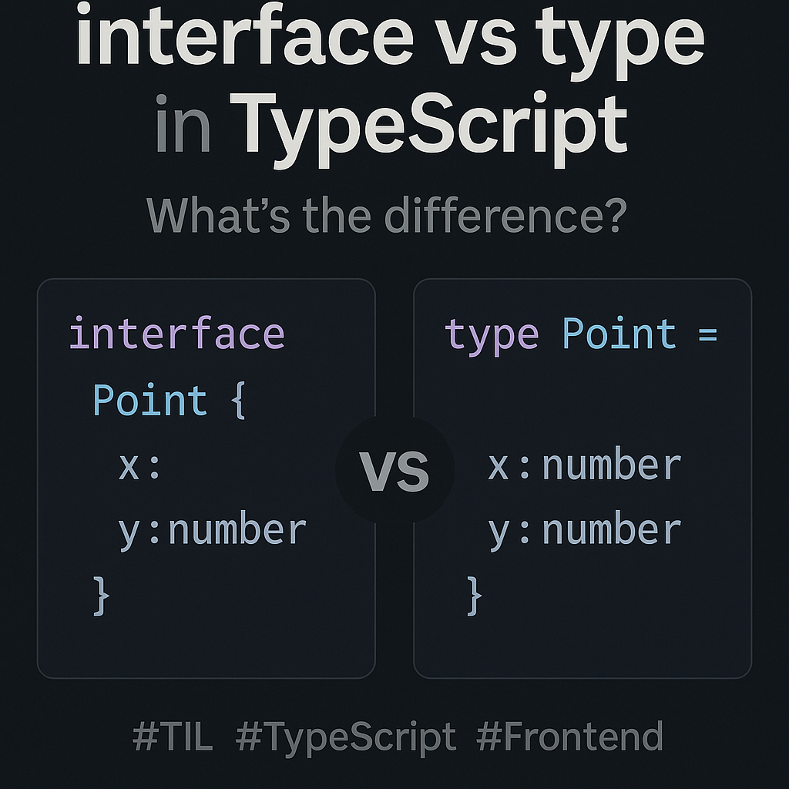

# interface와 type의 차이점과 올바른 사용법
`interface`와 `type`은 모두 **객체의 타입을 정의할 때 사용**되자만,  
용도와 표현력에서 약간의 차이가 있어 상황에 따라 선택적으로 사용하는 것이 좋습니다.

---
<br>

## 1️⃣ 핵심 비교 요약
|항목|`interface`|`type`|
|:----|:----|:----|
|목적| 구조적인 **객체 타입 선언**|다양한 형태의 타입 정의|
|확장성|`extends`로 상속 가능 (객체 중심)|`&` 연산자로 확장 (모든 타입에 사용 가능)|
|선언 병합| O (자동 병합됨) | X (불가, 재정의 시 에러)|
|표현력|객체 중심|유니언, 튜플, 조건부 타입 등 표현력 풍부|
|사용 추천|**객체, 클래스** 중심 구조|**복합적, 유연한 타입** 표현 시|

---
<br>

## 2️⃣ 실전 예시 - 사용자 정보를 정의해보기
### 🔹 `interface` 사용
```ts
interface User {
	id: number;
	name: string;
	isActive: boolean;
}
```

### 🔹 `type` 사용
```ts
type User = {
	id: number;
	name: string;
	isActive: boolean;
}
```
👉 **동일한 결과**를 내지만, 아래와 같은 상황에서 차이가 납니다.

---
<br>

## 3️⃣ 차이점 상세 정리
### 🔹 확장 방식: `extends` vs `&`
```ts
// interface
interface Person {
	name: string;
}
interface Employee extends Person {
	employeeId: number;
}

// type
type Person2 = { name: string; }
type Employee2 = Person2 & { employeeId: number };
```
✔️ 둘 다 확장 가능하지만, `interface`는 **객체 중심 계층화**, `type`은 범용 조합에 적합합니다.

---
<br>

### 🔹 선언 병합 (interface만 가능)
```ts
interface Box {
	size: number;
}
interface Box {
	color: string;
}

// 최종 결과
// interface Box {
//   size: number;
//   color: string;
// }
```
⚠️ `type`은 이름 중복 시 에러 발생 → 병합 불가
```ts
type Box = { size: number };
// ❌ Error: Duplicate identifier 'Box'
type Box = { color: string };
```

### 🔹 유니언/교차 타입 표현 (type만 가능)
```ts
type Status = 'loading' | 'success' | 'error';

type Response =
	| { status: 'loading' }
	| { status: 'success'; data: string; }
	| { status: 'error'; error: Error; };
```
✔️ `type`은 다양한 구조와 조합이 필요한 복잡한 상황에 더 적합합니다.  
✔️ `interface`는 **이런 유니언 타입을 표현할 수 없습니다.**

---
<br>
