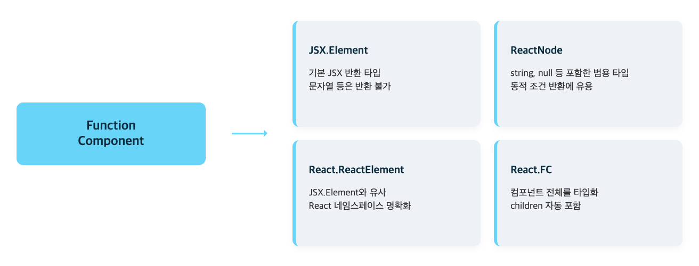

# 리액트 함수형 컴포넌트의 반환 타입 정리


## 1️⃣ 반환 타입 종류 및 차이점
### 🔹 JSX.Element
```tsx
const MyComponent = (): JSX.Element => {
	return <div>Hello</div>;
};
```
- **가장 기본적인 JSX 반환 타입**
- `React.createElement()` 의 반환 타입과 동일
- 실제로는 `React.ReactElement<any, any>`로 정의됨
- 주의점: `null`이나 `string` 같은 JSX 이외의 타입은 허용되지 않음

<br>

### 🔹 React.ReactElement
```tsx
cosnt MyComponent = (): React.ReactElement => {
	return <h1>Title</h1>;
};
```
- `JSX.Element`와 사실상 같은 의미지만 명확하게 `React` 네임스페이스를 사용할 수 있음
- JSX의 구체적인 반환을 타입으로 명시할 때 사용

<br>

### 🔹 ReactNode
```tsx
const MyComponent = (): React.ReactNode => {
	if (Math.random() > 0.5) return <div>Random</div>
	return 'Hello world';
};
```
- **가장 범용적인 반환 타입**
- `string`, `number`, `null`, `undefined`, `boolean`, JSX, `Fragment`, 배열 등 렌더링 가능한 모든 값 포함
- 동적으로 다양한 타입의 값을 반환할 가능성이 있을 때 적합 

<br>

### 🔹 React.FC (또는 React.FunctionComponent)
```tsx
const MyComponent: React.FC = () => {
  return <div>With children prop</div>;
};
```
- 컴포넌트 전체에 타입 부여
- `children` prop이 자동 포함됨
- Props 타입도 제네릭으로 지정 가능

```tsx
type Props = { name: string };

const Greet: React.FC<Props> = ({ name, children }) => {
  return (
    <div>
      Hello, {name}
      {children}
    </div>
  );
};
```
- `children` 자동 포함이 명시적이지 않음
- 반환 타입이 `ReactElement | null`로 제한됨

---
<br>

## 2️⃣ 타입 간의 관계 요약
|반환 타입|포함 범위|특징|사용 예시|
|:---|:---|:---|:---|
|`JSX.Element`|JSX 전용|가장 기본적인 JSX 타입|대부분의 컴포넌트|
|`React.ReactElement`|JSX|`JSX.Element`와 유사, 네임스페이스 명확|라이브러리용 컴포넌트|
|`ReactNode`|JSX + `string`, `null`, `number` 등 포함|가장 넓은 표현 범위|조건부 렌더링, 동적 출력|
|`Reaact.FC`|컴포넌트 전체|`children` 자동 포함|명확한 선언현 컴포넌트|

---
<br>

## 3️⃣ 예제 코드 비교
### 